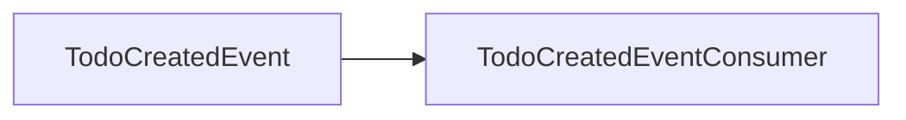
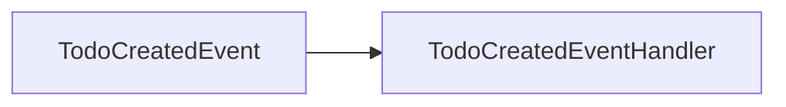
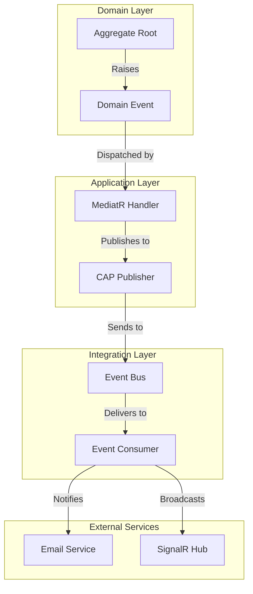
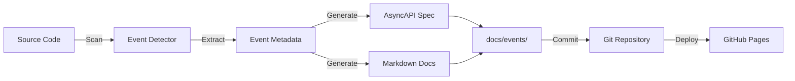

# Event Documentation System - Implementation Summary

## Overview

This document provides a comprehensive overview of the auto-generated event documentation system implemented for the Bootstrap project. The system automatically documents integration events (CAP) and domain events (MediatR) with minimal manual intervention.

## What Was Implemented

### 1. Documentation Generator (`tools/generate-docs.sh`)

A shell script that generates comprehensive documentation for all events in the system:

- **AsyncAPI 3.0 Specification**: Standards-compliant specification for async messaging
- **Integration Events Documentation**: Markdown with Mermaid flow diagrams
- **Domain Events Documentation**: Markdown with handler flow diagrams

### 2. Documentation Structure

```
docs/events/
├── README.md                    # Overview and architecture
├── asyncapi.yaml               # AsyncAPI 3.0 specification
├── integration-events.md       # CAP integration events
└── domain-events.md            # MediatR domain events
```

### 3. CI/CD Integration

Two GitHub Actions workflows:

#### `generate-event-docs.yml`
- Triggers on push to main or PR
- Builds the project
- Generates documentation
- Validates AsyncAPI spec
- Auto-commits updates (main branch only)
- Deploys to GitHub Pages

#### `docs-preview.yml`
- Triggers on PRs with event changes
- Posts a comment with documentation links
- Provides quick access to updated docs

### 4. Utility Scripts

- **`tools/generate-docs.sh`**: Main documentation generator
- **`tools/view-docs.sh`**: Local documentation viewer helper
- **`tools/README.md`**: Comprehensive tool documentation

### 5. .NET Tool (Future Enhancement)

- **`tools/EventDocGenerator/`**: C# project for dynamic assembly scanning
- Currently uses static templates
- Can be enhanced to scan assemblies programmatically

## Documentation Output Examples

### AsyncAPI Specification

The system generates a complete AsyncAPI 3.0 specification:

```yaml
asyncapi: 3.0.0
info:
  title: Bootstrap Integration Events API
  version: 1.0.0
channels:
  TodoCreatedEvent:
    address: TodoCreatedEvent
    messages:
      TodoCreatedEvent:
        payload:
          type: object
          properties:
            TodoId:
              type: string
              format: uuid
```

### Integration Events Documentation

Generated markdown with Mermaid diagrams:

```markdown
### TodoCreatedEvent

**Subscribers:**
- `Notifications.TodoCreatedEventConsumer.ProcessAsync`

**Message Flow:**

```

### Domain Events Documentation

Generated markdown showing event handlers:

```markdown
### TodoCreatedEvent

**Namespace:** `Contracts`

**Properties:**
- `TodoId`: Guid

**Handlers:**
- `Todos.Application.Features.Todo.Events.TodoCreatedEventHandler`

**Event Flow:**

```

## How to Use

### Generating Documentation Locally

```bash
# Run the documentation generator
./tools/generate-docs.sh

# View the generated documentation
./tools/view-docs.sh
```

### Viewing Documentation

1. **On GitHub**: Navigate to `docs/events/` in the repository
2. **Locally in VS Code**: Install "Markdown Preview Mermaid Support" extension
3. **AsyncAPI Studio**: Copy content of `asyncapi.yaml` to https://studio.asyncapi.com/
4. **GitHub Pages**: (If configured) View at `https://[username].github.io/bootstrap/`

### Adding New Events

1. Create the event class implementing `IDomainEvent`
2. Add handlers implementing `INotificationHandler<T>` or `ICapSubscribe`
3. Update `tools/generate-docs.sh` to include the new event in templates
4. Run `./tools/generate-docs.sh` to regenerate documentation
5. Commit the changes

## Architecture

### Event Flow



### Documentation Generation Flow



## Benefits

### For Developers

- **Automatic**: No manual documentation updates needed
- **Consistent**: Standardized format across all events
- **Visual**: Mermaid diagrams show event flows clearly
- **Searchable**: Easy to find events and their handlers

### For Operations

- **AsyncAPI Spec**: Standard format for integration
- **Version Controlled**: Documentation in Git
- **CI/CD Integrated**: Always up-to-date
- **Preview in PRs**: Review changes before merge

### For Architecture

- **Overview**: Complete picture of event-driven architecture
- **Traceability**: Track event publishers and consumers
- **Documentation**: Self-documenting codebase
- **Standards**: AsyncAPI 3.0 compliance

## Current Events Documented

### Integration Events (CAP)

1. **TodoCreatedEvent**
   - Publisher: `TodoCreatedEventHandler`
   - Consumer: `TodoCreatedEventConsumer`
   - Purpose: Notify when a Todo is created

2. **TodoCompletedEvent**
   - Publisher: `TodoCompletedEventHandler`
   - Consumer: `TodoCompletedEventConsumer`
   - Purpose: Notify when a Todo is completed

### Domain Events (MediatR)

1. **TodoCreatedEvent**
   - Handler: `TodoCreatedEventHandler`
   - Action: Publishes integration event

2. **TodoCompletedEvent**
   - Handler: `TodoCompletedEventHandler`
   - Action: Publishes integration event

## Future Enhancements

### Short Term

1. **Dynamic Scanning**: Complete the EventDocGenerator tool to scan assemblies automatically
2. **Extended Metadata**: Extract XML documentation comments
3. **Payload Schemas**: Generate full JSON schemas for event payloads

### Medium Term

1. **Event Statistics**: Track event publishing/consumption metrics
2. **Event Versioning**: Document event version history
3. **Test Coverage**: Show which events have tests

### Long Term

1. **Interactive Portal**: Build full Docusaurus portal
2. **Event Catalog**: Searchable event catalog with filtering
3. **GraphQL API**: Query event documentation via GraphQL
4. **Event Replay**: Documentation for event replay capabilities

## Compliance & Standards

- ✅ **AsyncAPI 3.0**: Latest AsyncAPI specification
- ✅ **Mermaid Diagrams**: Standard diagram-as-code format
- ✅ **Markdown**: GitHub-flavored markdown
- ✅ **YAML**: Standards-compliant YAML format
- ✅ **Semantic Versioning**: Version tracking in AsyncAPI spec

## Validation

The system includes validation at multiple levels:

1. **YAML Syntax**: Validates AsyncAPI YAML syntax
2. **AsyncAPI Spec**: Validates against AsyncAPI 3.0 schema
3. **File Existence**: Checks all expected files are generated
4. **Content Validation**: Verifies required content is present
5. **Build Integration**: Runs in CI/CD pipeline

## Troubleshooting

See [`tools/README.md`](../tools/README.md) for detailed troubleshooting steps.

## References

- [AsyncAPI 3.0 Specification](https://www.asyncapi.com/docs/reference/specification/v3.0.0)
- [CAP Framework Documentation](https://cap.dotnetcore.xyz/)
- [MediatR Documentation](https://github.com/jbogard/MediatR)
- [Mermaid Diagram Documentation](https://mermaid.js.org/)
- [GitHub Actions Documentation](https://docs.github.com/en/actions)

## Maintenance

### Regular Updates

- Review and update documentation when adding new events
- Validate AsyncAPI spec compatibility with new versions
- Keep CI/CD workflows updated with latest actions

### Monitoring

- Check GitHub Actions runs for failures
- Validate generated documentation periodically
- Review PR comments for documentation changes

---

**Last Updated**: 2025-01-29  
**Version**: 1.0.0  
**Status**: Production Ready ✅
