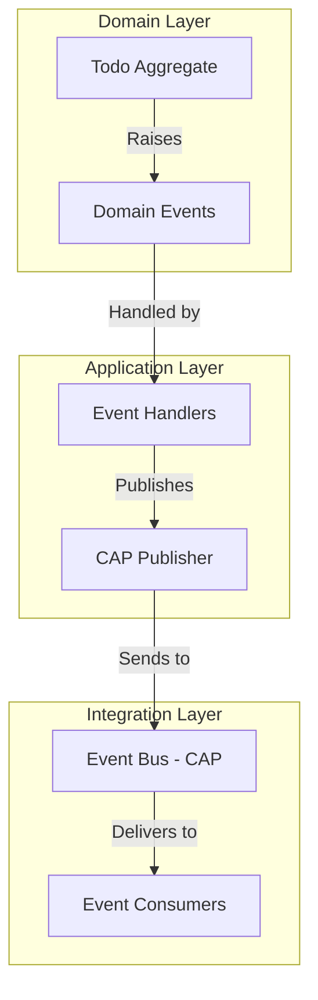

# Event Documentation

This directory contains auto-generated documentation for integration events (CAP) and domain events (MediatR) in the Bootstrap project.

## Files

- **asyncapi.yaml**: AsyncAPI 3.0 specification for CAP integration events
- **integration-events.md**: Documentation for CAP integration events with message flows
- **domain-events.md**: Documentation for MediatR domain events with event handlers and flow diagrams

## Overview

### Integration Events (CAP)

Integration events are used for communication between different services/modules using the CAP framework. These events are published and consumed asynchronously.

**Topics:**
- `TodoCreatedEvent` - Published when a new Todo is created
- `TodoCompletedEvent` - Published when a Todo is marked as completed

See [integration-events.md](./integration-events.md) for detailed documentation.

### Domain Events (MediatR)

Domain events are used within the application to handle business logic changes using MediatR. They follow the domain-driven design pattern.

**Events:**
- `TodoCreatedEvent` - Raised when a Todo entity is created
- `TodoCompletedEvent` - Raised when a Todo entity is completed

See [domain-events.md](./domain-events.md) for detailed documentation with handlers and flow diagrams.

## Regenerating Documentation

To regenerate the event documentation, run:

```bash
./tools/generate-docs.sh
```

This will scan the source code and update the documentation files in `docs-output/`, which can then be copied to `docs/events/`.

## AsyncAPI Specification

The AsyncAPI specification can be visualized using:

- [AsyncAPI Studio](https://studio.asyncapi.com/) - Paste the content of `asyncapi.yaml`
- [AsyncAPI Generator](https://www.asyncapi.com/tools/generator) - Generate HTML documentation

## Architecture



## Event Flow Example

1. **Todo Created**:
   - User creates a new Todo via API
   - `Todo` aggregate is created and raises `TodoCreatedEvent` (Domain Event)
   - `TodoCreatedEventHandler` catches the event
   - Handler publishes `TodoCreatedEvent` to CAP event bus (Integration Event)
   - `TodoCreatedEventConsumer` in Notifications service receives the message
   - Email notification is sent to user

2. **Todo Completed**:
   - User marks a Todo as complete via API
   - `Todo` aggregate is updated and raises `TodoCompletedEvent` (Domain Event)
   - `TodoCompletedEventHandler` catches the event
   - Handler publishes `TodoCompletedEvent` to CAP event bus (Integration Event)
   - `TodoCompletedEventConsumer` in Notifications service receives the message
   - SignalR notification is sent to connected clients
   - Email notification is sent to user
