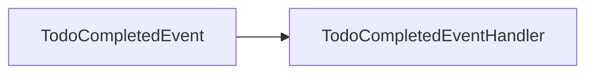
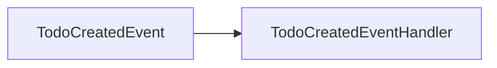

# Domain Events Documentation

This document lists all domain events (MediatR) in the system and their handlers.

## Events

### TodoCompletedEvent

**Namespace:** `Contracts`

**Properties:**

- `Id`: Guid
- `Title`: String

**Handlers:**

- `Todos.Application.Features.Todo.Events.TodoCompletedEventHandler`

**Event Flow:**

---

### TodoCreatedEvent

**Namespace:** `Contracts`

**Properties:**

- `TodoId`: Guid

**Handlers:**

- `Todos.Application.Features.Todo.Events.TodoCreatedEventHandler`

**Event Flow:**

---

