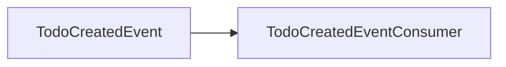
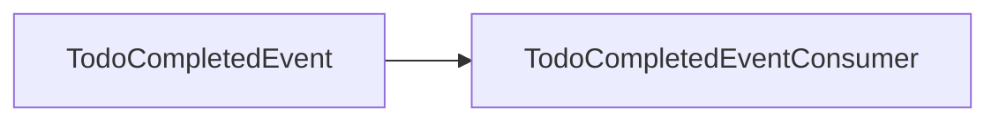

# Integration Events Documentation

This document lists all integration events (CAP) in the system.

## Topics

### TodoCreatedEvent

**Subscribers:**

- `Notifications.TodoCreatedEventConsumer.ProcessAsync` (Message: `TodoCreatedEvent`)

**Message Flow:**

---

### TodoCompletedEvent

**Subscribers:**

- `Notifications.TodoCompletedEventConsumer.ProcessAsync` (Message: `TodoCompletedEvent`)

**Message Flow:**

---

