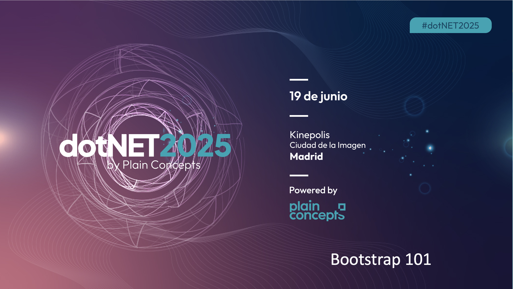
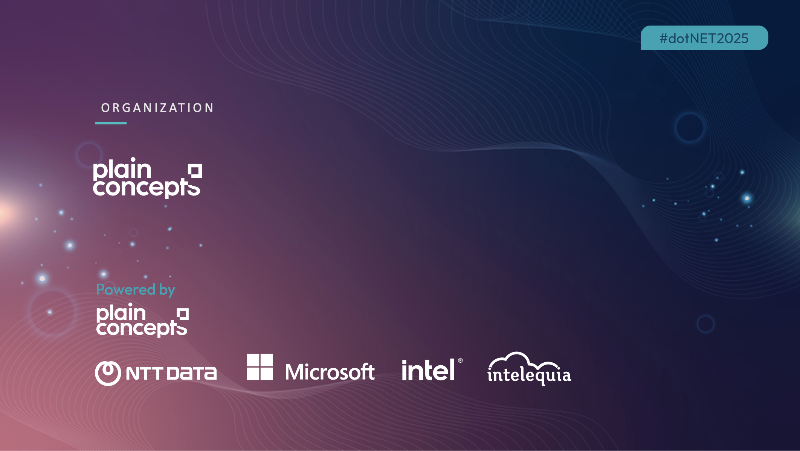
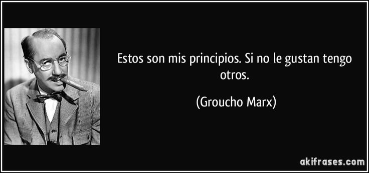
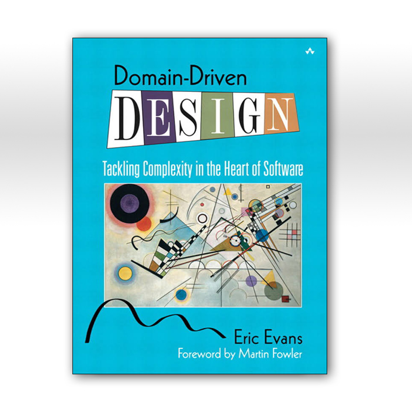
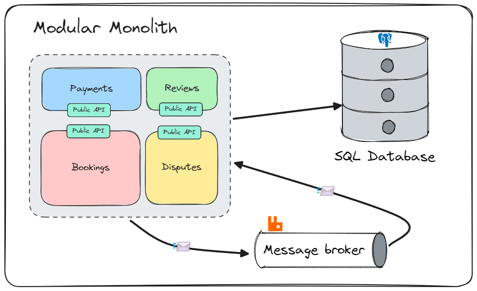

---



---
layout: about-me

helloMsg: Hola!
name: Andoni Santamaria
job: Developer at Plain Concepts, MVP de Microsoft
imageSrc: ./andoni.png


---

---

# 🤔 ¿Por qué esta charla?


<v-clicks>

- Cada nuevo proyecto no empieza de cero (reutilizamos experiencia)
- Los templates son útiles, pero insuficientes
- Necesitamos aprender de éxitos y fracasos previos
- Las decisiones técnicas deben documentarse como consecuencia de experiencias anteriores
- Un buen inicio ahorra meses de refactorización
- Lo que funciona debe convertirse en decisiones escritas, no solo en "tradición". Quizás mañana no funcione igual.
- Esto que vais a ver es un enfoque que hemos probado y funciona. (Opionated by experience, not dogma)
- No es un enfoque rígido, sino una guía para empezar con buen pie

</v-clicks>

<!--
- Cada nuevo proyecto no empieza de cero (reutilizamos experiencia)
- Los templates son útiles, pero insuficientes
- Necesitamos aprender de éxitos y fracasos previos
- Las decisiones técnicas deben documentarse como consecuencia de experiencias anteriores
- Un buen inicio ahorra meses de refactorización
- Lo que funciona debe convertirse en decisiones escritas, no solo en "tradición". Quizás mañana no funcione igual.
- Esto que vais a ver es un enfoque que hemos probado y funciona. (Opionated by experience, not dogma)
- No es un enfoque rígido, sino una guía para empezar con buen pie
-->

---
layout: center
---

# 🧠 Decisiones de arquitectura

---

### 🏢 ¿Qué tipo de empresa?

<v-clicks>

- **Madurez técnica**: Empresa con experiencia en desarrollo de software
- **Cultura de calidad**: Tests y QA son parte del ADN organizacional
- **Estándares establecidos**: Procesos y metodologías bien definidos

</v-clicks>


<br/>

<v-clicks>

### 👥 ¿Qué tipo de equipo?
- **Experiencia técnica**: Sólido conocimiento en la tecnología elegida y arquitectura de software
- **Testing mindset**: Cultura de testing y calidad integrada
- **Capacidad de evolución**: Equipo capaz de adaptar y hacer crecer la arquitectura

</v-clicks>

<v-click>
<br/>

### 🚀 ¿Qué tipo de proyecto?
- **Visión a largo plazo**: No es un MVP, se espera evolución y crecimiento
- **Complejidad esperada**: Proyecto no trivial con requisitos cambiantes
- **Soporte de infraestructura**: Equipo de DevOps disponible

</v-click>

<!--

[click] [¿Qué tipo de empresa?](#)


[click] [¿Qué tipo de equipo?](#)


[click] [¿Qué tipo de proyecto?](#)
-->


---

## 📝 Principio clave
> **Documentar el "por qué", no solo el "qué"**

Cada decisión debe incluir el contexto y las razones que la motivaron


<v-click>

```md
## Decisión: No usar microservicios
- Justificación: complejidad innecesaria
- Evaluamos opciones
- Revisaremos en 6 meses
```

</v-click>

<!--

Principio clave: Documentar el "por qué", no solo el "qué"

Como desarrolladores, a menudo nos enfocamos en el "qué" de las decisiones técnicas, pero es crucial entender el "por qué". Cada decisión debe incluir el contexto y las razones que la motivaron.

y para ello SIGUIENTE SLIDE
-->


---

# 📘 Docs como código

* ADRs (`/docs/adr/001-decision.md`)
* Se versionan junto al código
* Revisables vía Pull Request
* **Herramientas**: `adr-tools`, `adr-log`, `madr`

<v-click>

```bash
# Instalar adr-tools (macOS)
brew install adr-tools

# Crear nueva decisión
adr new "Data Access Strategy"
```

</v-click>

<!--

Utilizamos ADRs (Architectural Decision Records) para documentar decisiones clave de arquitectura.

Estas se almacenan en `/docs/adr/` y se versionan junto al código, lo que permite revisarlas y actualizarlas fácilmente.

Las ADRs son revisables vía Pull Request, lo que asegura que el equipo pueda discutir y acordar las decisiones antes de implementarlas.

Adicionalmente, existen herramientas como `adr-tools`, `adr-log` o `madr` que facilitan la creación y gestión de estas decisiones.

Siguiente slide para ver un ejemplo de ADR
-->

---

**Ejemplo:** `/docs/adr/0002-data-access-strategy.md`

<v-click>

```md
# 2. Data Access Strategy

## Decision
**Enfoque híbrido basado en el caso de uso:**

🔧 **EF Core**: Comandos (CRUD), migrations
⚡ **Dapper**: Queries complejas, reportes  
🚀 **SQL crudo**: Performance crítica

## Consequences
✅ Performance optimizada por contexto
❌ Múltiples abstracciones a mantener
```

</v-click>

---
layout: center
---

# 🔧 Setup inicial

---

# Objetivos del setup

<v-clicks>

* dotnet run para iniciar el proyecto
* SOLID 
* KISS (Keep It Simple, Stupid)
* No overengineering
* YAGNI (You Aren't Gonna Need It)

</v-clicks>

<!--

Objetivos del setup:

* dotnet run para iniciar el proyecto 

    sin complicaciones para el desarrollador, cuando estamos en consultoría vamos saltando de proyecto en proyecto y no podemos perder tiempo en configuraciones complejas

* SOLID
    queremos que el código sea mantenible y escalable, siguiendo los principios SOLID

* KISS (Keep It Simple, Stupid)

    siempre que podamos simplificar, lo haremos, no queremos complicar la vida al desarrollador

* No overengineering

    no queremos añadir complejidad innecesaria, queremos que el desarrollador pueda centrarse en lo importante

* YAGNI (You Aren't Gonna Need It)

    no añadimos funcionalidades que no vamos a necesitar, queremos que el desarrollador pueda centrarse en lo importante

-->

---

# 🚀 Aspire como base


* `dotnet aspire new` para plantilla
* Dashboard out-of-the-box
* Simplifica microservicios y observabilidad local


```bash
dotnet new aspire-webapi -n MyApp
```

<!--

Aspire es una librería que simplifica el desarrollo de aplicaciones .NET, especialmente en el contexto de microservicios y observabilidad local.

Es el punto de partida para crear aplicaciones modernas y escalables. 

Microsoft ha creado Aspire para facilitar el desarrollo de aplicaciones .NET, especialmente en el contexto de microservicios y observabilidad local.

* `dotnet aspire new` para crear un nuevo proyecto con Aspire

* Incluye un dashboard out-of-the-box para monitorizar la aplicación

* Simplifica la implementación de aplicaciones distribuidas y la observabilidad local

* Permite iniciar rápidamente un proyecto con buenas prácticas y convenciones

En un futuro no muy lejano también la parte de infra como código

-->

---

# 📈 Telemetría

* Logs estructurados
* Métricas y trazas
* Integración con OpenTelemetry
* Export a Application Insights, etc (no vendor lock-in)

```csharp {monaco}
builder.Logging.AddOpenTelemetry(o =>
{
    o.AddConsoleExporter();
    o.AddOtlpExporter();
});

builder.Services.AddOpenTelemetry()
    .WithMetrics(metrics =>
    {
        metrics.AddAspNetCoreInstrumentation()
            .AddHttpClientInstrumentation()
            .AddRuntimeInstrumentation();
    })
    .WithTracing(tracing =>
    {
        tracing.AddAspNetCoreInstrumentation()
            .AddEntityFrameworkCoreInstrumentation()
            .AddCapInstrumentation();
    })
    .AddOpenTelemetryExporters(builder);

```

---

# global.json (raiz del proyecto)

```json{all|3}
{
  "sdk": {
    "version": "9.0.100",
    "rollForward": "latestPatch",
    "allowPrerelease": false
  }
}
```

<v-clicks>

- Define con precisión la versión del SDK de .NET a utilizar
- Asegura consistencia entre todos los miembros del equipo
- Evita el clásico "en mi máquina funciona"
- Configura `rollForward` para controlar actualizaciones automáticas
- Facilita la reproducibilidad en entornos de CI/CD

</v-clicks>

---

# Directory.Build.props (raiz del proyecto)

```xml{all|4|5|6}
<Project>
  <PropertyGroup>
    <LangVersion>preview</LangVersion>
    <TargetFramework>net9.0</TargetFramework>
    <Nullable>enable</Nullable>
    <TreatWarningsAsErrors>true</TreatWarningsAsErrors>
  </PropertyGroup>
</Project>
```
<!--
- Define propiedades comunes para todo el proyecto
- Configura la versión del lenguaje C# a utilizar
- Establece el framework de destino (net9.0)
- Habilita la compatibilidad con tipos anulables
- Trata todas las advertencias como errores para mejorar la calidad del código
- Permite centralizar configuraciones comunes en un solo archivo


-->

---

# .editorconfig

Son reglas de estilo de código que se aplican a todo el proyecto, facilitando la consistencia y la legibilidad del código.

```ini
root = true

# C# files
[*.cs]

#### Core EditorConfig Options ####

# Indentation and spacing
indent_size = 4
indent_style = space
tab_width = 4

```

<!--

- Configuración de estilo de código

- Reglas de formato y convenciones

- Facilita la consistencia en el código del equipo

- Se puede extender con reglas personalizadas

- Se puede integrar con herramientas de análisis estático

- Podemos hacer que la build falle si no se cumplen las reglas de estilo.

-->

---

# Directory.Packages.props (CPM, raiz del proyecto)

```xml{all|3-4|8|10}
<Project>
  <PropertyGroup>
    <ManagePackageVersionsCentrally>true</ManagePackageVersionsCentrally>
    <AspireVersion>9.3.0</AspireVersion>
  </PropertyGroup>
  <ItemGroup>
    <PackageVersion Include="Aspire.Hosting" Version="$(AspireVersion)" />
    <PackageVersion Include="Aspire.Npgsql.EntityFrameworkCore.PostgreSQL" Version="9.2.1" />
    <!-- Static code analysis -->
    <GlobalPackageReference Include="SonarAnalyzer.CSharp" Version="10.11.0.117924" />
    <!-- Más versiones centralizadas... -->
  </ItemGroup>
</Project>
```
---

# Uso de CPM

```csharp
// En .csproj solo referenciar el paquete sin versión
<ItemGroup>
  <PackageReference Include="Aspire.Hosting" VersionOverride="9.2" />
  <PackageReference Include="xunit" Condition="'$(IsTestProject)' == 'true'" />
</ItemGroup>
```

---

# husky

<v-clicks>


- Pre-commit hooks para validar el código antes de hacer commit
- Configuración en `.husky/`

```bash
npx husky install
npx husky add .husky/pre-commit "dotnet format --check"
```


</v-clicks>


---
layout: center
---



<!--
husky
secretos
keyvault
-->

---

# 🔧 Arquitectura (opinionated)

<v-clicks>

- Trabajo en una empresa con experiencia en desarrollo de software
- Ponemos el foco en la calidad del código y la cultura de testing
- Queremos crear proyectos mantenibles y adaptables que puedan evolucionar
- Adoptar un enfoque moderno sin overengineering, arquitectura emergente
- Usamos Aspire para simplificar el desarrollo y observabilidad local
- Usamos DDD para modelar el dominio de forma rica y testable 

</v-clicks>

---
layout: center

---


**"Don't start with microservices, start with a monolith"**

<br>

 Martin Fowler


---

## 🏛️ Arquitectura: Modular *Monolith*


<v-clicks>

Un solo proyecto para todas las capas

Módulos por carpeta (App, Domain, Infra, Web)

Cada modulo usa su propio schema de BBDD

Estructura de carpetas clara y predecible

ArchTest para validar dependencias


```csharp {all|6-8}
public class ArchitectureTests
{
    [Fact]
    public void Domain_Should_Not_Depend_On_Application()
    {
        Types.InAssembly(typeof(Domain.Todo).Assembly)
            .Should()
            .NotHaveDependencyOn("Application");
    }
}
```

</v-clicks>


---

## 📦 Modelo de dominio: DDD vs Anemic

<v-clicks>


| Anémico (❌) | Enriquecido (✅) |
|-------------|-----------------|
| Solo propiedades | Comportamiento encapsulado |
| Lógica en servicios | Lógica en el modelo |
| Setters públicos | Setters privados/protegidos |
| Sin validación | Autovalidación en constructores |
| Entidades mutables | Inmutabilidad cuando sea posible |
| Sin historia de dominio | Eventos de dominio integrados |
| Estado inconsistente | Garantía de estado válido |
| Difícil de testear en aislamiento | Fácil de testear unitariamente |
| Acoplado a infraestructura | Independiente de infraestructura |

</v-clicks>

---

## 📦 Ejemplo: Modelo anémico vs DDD

````md magic-move
```csharp
public class Todo
{
    public Guid Id { get; set; }
    public string Title { get; set; } = "";
    public bool Completed { get; set; }
}

public class TodoService(IEventPublisher publisher)
{
    public void CompleteTodo(Todo todo)
    {
        // Validación y lógica fuera del modelo
        if (todo.Completed)
            return;
        
        todo.Completed = true;
        publisher.Publish(new TodoCompletedEvent(todo.Id, todo.Title));
    }
}
```
```csharp
public class Todo : BaseEntity
{   
    public string Title { get; protected set; } = default!;
    public bool Completed { get; protected set; }
    
    public Todo(string title)
    {
        ArgumentException.ThrowIfNullOrWhiteSpace(title, nameof(title));
        Raise(new TodoCreatedEvent(Id));
        Title = title;
    }
    
    public void CompleteTodo()
    {
        if (Completed)
        {
            return;
        }
        
        Completed = true;
        Raise(new TodoCompletedEvent(Id, Title));
    }
}
```
````

---

## 💎 Beneficios del enfoque DDD
<v-clicks>

* Mayor integridad de datos
* Modelos que reflejan el lenguaje del negocio
* Mejor testabilidad y mantenibilidad
* Separación clara entre modelo interno y contratos API

</v-clicks>

<!--


* Mayor integridad de datos: el modelo garantiza invariantes y estado válido
* Modelos que reflejan el lenguaje del negocio: el modelo es rico y refleja el dominio
* Mejor testabilidad y mantenibilidad: el modelo es fácil de testear unitariamente
* Separación clara entre modelo interno y contratos API: el modelo es independiente de la infraestructura y los contratos API   

Podemos usar este modelo para crear objectos de dominio mas testables y reutilizables

-->

---
layout: two-cols
---

## DDD sin dogmas

<v-clicks>

- DDD no es un dogma
- No es necesario seguir todos los patrones de DDD al pie de la letra
- Erics Evans dice que DDD es un enfoque para resolver problemas complejos, no una receta rígida.

</v-clicks>

::right:: 




<!--

NO es un dogma, es un enfoque para resolver problemas complejos, no una receta rígida.

No es necesario seguir todos los patrones de DDD al pie de la letra, sino aplicar los principios que nos ayuden a crear un modelo de dominio efectivo.

Erics Evans dice que DDD es un enfoque para resolver problemas complejos, no una receta rígida.


-->

---

## 🏛️ Arquitectura: CQS (Command Query Segregation)

<v-clicks>


- Comandos y consultas separados
- Comandos: mutan el estado del sistema (usan eventos de dominio y Entity Framework)
- Consultas: obtienen datos sin mutar el estado (usando Dapper o consultas directas)
- Para simplificar usamos file scoped classes y records
- Usamos el Result pattern para manejar errores y resultados 


-   ```csharp {all|3-4}
    public record TodoCommand(Guid Id, string Title) : ICommand<Result<Todo>>;

    public class TodoCommandHandler(DbContext dbContext) : ICommandHandler<TodoCommand, Result<Todo>>
    {
        public async Task<Result<Todo>> Handle(TodoCommand command, CancellationToken cancellationToken)
        {
            var todo = Todo.Create(command.Title);
            dbContext.AddA(todo);
            await dbContext.SaveChangesAsync(cancellationToken);
            return Result.Ok(todo);
        }
    }
    ```

</v-clicks>
---

# 🔐 Módulos comunes a establecer por equpio/empresa

* Auth (JWT / Azure AD)
* Infraestructura como código (Bicep / Terraform)
* Auditoria 


```bicep
resource appServicePlan 'Microsoft.Web/serverfarms@2022-03-01' = {
  name: 'asp-plan'
  location: resourceGroup().location
  sku: {
    name: 'B1'
  }
}
```

---

## 📊 Testing como cultura

<v-clicks>

- Unitarios con xUnit + **Build pattern**
- Funcionales con WebApplicationFactory + **Build pattern** + TestsContainers + Respawn
- Test de arquitectura con ArchUnit.NET
- E2E con Playwright (Aspire integrado)
- No Mock, para dependencias externas, WireMock


</v-clicks>

<!--

Build pattern beneficios, podemos crear objetos de dominio de forma fluida y reutilizable para pruebas unitarias y funcionales, cubriendo la lógica de negocio y los modelos de forma eficiente.

- Unitarios con xUnit + **Build pattern**: pruebas unitarias para lógica de negocio y modelos
- Funcionales con WebApplicationFactory + **Build pattern**: pruebas funcionales para endpoints y servicios
- Test de arquitectura con ArchUnit.NET: validación de dependencias y estructura del código
- E2E con Playwright (Aspire integrado): pruebas end-to-end para flujos completos de usuario


-->

---

## 🧪 Ejemplo de build pattern

````md magic-move
```csharp

public class TodoBuilder
{
    private string _defaultTitle = "Default Todo Title";
    private bool _defaultCompleted = false;

    public TodoBuilder WithTitle(string title)
    {
        _todo.Title = title;
        return this;
    }

    public TodoBuilder MarkAsCompleted()
    {
        _todo.Completed = true;
        return this;
    }

    public Todo Build()  
    {
        return new Todo(_todo.Title)
        {
            Completed = _todo.Completed
        };
    }
}
```
```csharp

public class TodoBuilder
{
    public TodoBuilder But()
    {
        var clone = new TodoBuilder();
        clone.WithTitle(_defaultTitle);
        clone.MarkAsCompleted();
        return clone;
    }   
}

var todo = new TodoBuilder()
    .WithTitle("My Todo")
    .MarkAsCompleted();

var todo2 = todo.But()
    .WithTitle("My Todo 2")
    .Build();
    
```
````

---

## 🗂️ Estructura del proyecto ejemplo

``` {1-4|5|6,7|8-12|13-16|17-22}

├── 📄 Directory.Build.props       # Configuración centralizada
├── 📄 Directory.Packages.props    # Central Package Management
├── 📄 global.json                 # Versión del SDK
├── 📄 .editorconfig               # Configuración de estilo
├── 📁 infra/                      # Infraestructura como código
├── 📁 docs/                       # Documentación
│   └── 📁 adr/                    # Decisiones arquitectónicas
├── 📁 src/
│   ├── 📁 Api/                    # API pública y endpoints
│   ├── 📁 AspireHost/             # Aspire
│   ├── 📁 ServiceDefaults/        # Configuración de servicios
│   ├── 📁 BuildingBlocks/         # Componentes compartidos
│   └── 📁 Modules/               
│       └── 📁 Todo/               # Módulo de ejemplo
│            ├── 📁 Application/   # Lógica de negocio
│            └── 📁 Tests/         # Tests de módulo
└── 📁 tests/
   ├── 📁 ArchTests/              # Tests de arquitectura
   ├── 📁 E2ETests/               # Tests end-to-end
   ├── 📁 FunctionalTests/        # Tests funcionales
   └── 📁 IntegrationTests/       # Tests de integración
``` 

<!--

Es importante tener una estructura de proyecto clara y predecible para facilitar la navegación y el mantenimiento del código.

Entre modulos la comunicación se realiza a través de eventos, evitando dependencias directas.

Así podemos tener un monolito modular que se puede escalar y evolucionar con el tiempo.

-->

---

# Diagrama de modulos 

<Excalidraw drawFilePath="./diagrams/modular monoliths database.excalidraw"  class="w-[900px]"  :darkMode="false"  :background="true" />

---

# Extraccion de módulos



---

## 📦 Dependencias de librerías externas


<v-clicks>

¿Cuánta gente usa MediatR en la sala? 🙋‍♂️

¿Cuántos conocéis eventing framework de .Net ~~9, 10~~, 11? 🙋‍♂️

https://github.com/dotnet/aspnetcore/issues/53219
Jimmy Bogard, Jeremy D. Miller, David Fowler, etc. 


### El problema real

- **FluentValidation**: es comercial 💰
- **MediatR**: va a ser comercial 💰
- **MassTransit**: va a ser comercial 💰
- **Otras librerías populares** pueden seguir el mismo camino

<br/>

### ⚠️ Riesgos de dependencias externas

- **Cambios de licencia** (open source → comercial)
- **Abandono del proyecto** (mantenimiento)
- **Breaking changes** sin control
- **Vendor lock-in**

</v-clicks>


---

## 🛠️ Posibles soluciones

<br/>

<v-click>

### 1. **Fork del proyecto** 🍴
- Mantener la última versión open source
- Control total pero **responsabilidad** de mantenimiento
- Ejemplo: ElasticSearch → OpenSearch

</v-click>

<br/>

<v-click>

### 2. **Librerías alternativas** 🔄
- **Mediator** (más ligera que MediatR, usa source generators)
- **FastEndpoints** (alternativa completa)
- **LiteBus** (orientada a CQRS)

</v-click>

<br/>

<v-click>

### 3. **Implementación propia** ⚒️
- **Control total** sobre la funcionalidad
- **Conocimiento** del equipo sobre el código
- Mantenimiento **interno**

</v-click>

---

## ✅ Conclusiones

<v-clicks>

- Everything as code
- Modular Monolith + Aspire 
- Infraestructura y documentación como código aumentan calidad
- Modelo de dominio enriquecido (DDD) mejora mantenibilidad
- CQS separa comandos y consultas para mayor claridad
- Testing integrado en la cultura del equipo
- Gestión cuidadosa de dependencias externas

</v-clicks>

---
layout: center
---

## ¿Preguntas?
<br/>


📩 [asantamaria@plainconcepts.com](mailto:asantamaria@plainconcepts.com)  

<br/>

🔗 github.com/andonisan/bootstrap

<br>

X @AndoniSantamari


---
