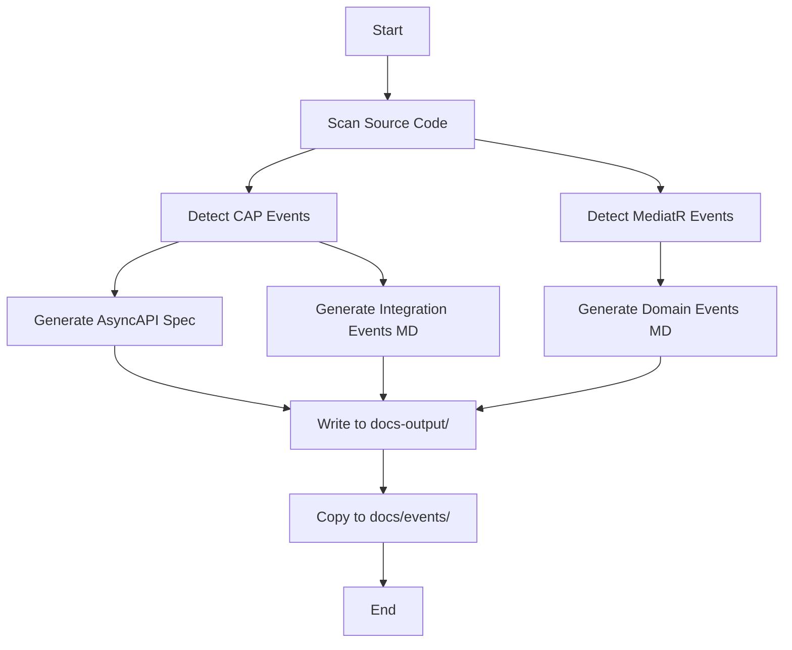

# Event Documentation Tools

This directory contains tools for auto-generating documentation for integration events (CAP) and domain events (MediatR).

## Tools Overview

### 1. `generate-docs.sh`

**Purpose**: Main script to generate event documentation

**Usage**:
```bash
./tools/generate-docs.sh
```

**What it does**:
- Scans the source code for event definitions
- Generates AsyncAPI 3.0 specification (YAML)
- Creates Markdown documentation with Mermaid diagrams
- Outputs files to `docs-output/` directory

**Output Files**:
- `docs-output/asyncapi.yaml` - AsyncAPI specification
- `docs-output/integration-events.md` - CAP integration events
- `docs-output/domain-events.md` - MediatR domain events

### 2. `view-docs.sh`

**Purpose**: Local documentation viewer helper

**Usage**:
```bash
./tools/view-docs.sh
```

**What it does**:
- Checks if documentation exists
- Shows file sizes and locations
- Provides viewing instructions

### 3. `EventDocGenerator/`

**Purpose**: .NET tool for scanning assemblies (advanced usage)

**Status**: Work in progress - currently encounters assembly loading issues

**Future Enhancement**: This tool could be enhanced to dynamically scan compiled assemblies to extract event information programmatically.

**Current Approach**: The `generate-docs.sh` script uses static templates based on known events in the codebase.

## How It Works

### Event Detection

The documentation system identifies two types of events:

#### Integration Events (CAP)

Integration events are detected by finding:
- Classes implementing `ICapSubscribe`
- Methods decorated with `[CapSubscribe("TopicName")]`
- Calls to `ICapPublisher.PublishAsync()`

**Example**:
```csharp
public class TodoCreatedEventConsumer : ICapSubscribe
{
    [CapSubscribe(nameof(TodoCreatedEvent))]
    public async Task ProcessAsync(TodoCreatedEvent evt)
    {
        // Handle event
    }
}
```

#### Domain Events (MediatR)

Domain events are detected by finding:
- Records/classes implementing `IDomainEvent`
- Handlers implementing `INotificationHandler<TEvent>`

**Example**:
```csharp
public record TodoCreatedEvent(Guid TodoId) : IDomainEvent;

public class TodoCreatedEventHandler : INotificationHandler<TodoCreatedEvent>
{
    public async Task Handle(TodoCreatedEvent notification, CancellationToken ct)
    {
        // Handle event
    }
}
```

### Documentation Generation Process



### CI/CD Integration

The documentation is automatically updated through GitHub Actions:

1. **Trigger**: Push to main or PR with event changes
2. **Build**: Compile the project
3. **Generate**: Run `generate-docs.sh`
4. **Validate**: Validate AsyncAPI spec with `@asyncapi/cli`
5. **Commit**: Auto-commit changes (main branch only)
6. **Deploy**: Publish to GitHub Pages (optional)

## Adding New Events

When you add new events to the system:

### For Integration Events (CAP)

1. Create a new event class in `src/Contracts/`:
```csharp
public record MyNewEvent(string Data) : IDomainEvent;
```

2. Add a publisher handler:
```csharp
public class MyNewEventHandler : INotificationHandler<MyNewEvent>
{
    private readonly ICapPublisher _publisher;
    
    public async Task Handle(MyNewEvent notification, CancellationToken ct)
    {
        await _publisher.PublishAsync(nameof(MyNewEvent), notification, cancellationToken: ct);
    }
}
```

3. Add a consumer:
```csharp
public class MyNewEventConsumer : ICapSubscribe
{
    [CapSubscribe(nameof(MyNewEvent))]
    public async Task ProcessAsync(MyNewEvent evt)
    {
        // Process event
    }
}
```

4. Update `tools/generate-docs.sh` to include the new event in the documentation templates.

### For Domain Events (MediatR)

1. Create a new event:
```csharp
public record MyDomainEvent(Guid Id, string Data) : IDomainEvent;
```

2. Create a handler:
```csharp
public class MyDomainEventHandler : INotificationHandler<MyDomainEvent>
{
    public async Task Handle(MyDomainEvent notification, CancellationToken ct)
    {
        // Handle event
    }
}
```

3. Update `tools/generate-docs.sh` to include the new event.

## Future Enhancements

### Planned Improvements

1. **Dynamic Assembly Scanning**: 
   - Complete the `EventDocGenerator` tool to scan compiled assemblies
   - Automatically detect new events without manual updates
   - Use reflection to extract property information

2. **Extended AsyncAPI Support**:
   - Add payload schemas for each event
   - Include examples and descriptions from XML comments
   - Support for message headers and metadata

3. **Interactive Documentation**:
   - Generate HTML documentation automatically
   - Add search functionality
   - Include event usage statistics

4. **Testing**:
   - Add unit tests for the documentation generator
   - Validate generated documentation format
   - Check for completeness

## Troubleshooting

### Documentation not generating?

1. Check that all events are defined in the expected locations
2. Ensure `generate-docs.sh` has execute permissions: `chmod +x tools/generate-docs.sh`
3. Review the script output for any errors

### AsyncAPI validation failing?

1. Verify YAML syntax with: `python3 -c "import yaml; yaml.safe_load(open('docs-output/asyncapi.yaml'))"`
2. Check AsyncAPI version compatibility (currently using 3.0.0)
3. Validate online at: https://studio.asyncapi.com/

### Mermaid diagrams not rendering?

1. Ensure you're viewing on GitHub or in a Markdown viewer that supports Mermaid
2. VS Code: Install "Markdown Preview Mermaid Support" extension
3. Alternative: Use https://mermaid.live/ to render diagrams

## References

- [AsyncAPI Specification](https://www.asyncapi.com/docs/reference/specification/latest)
- [CAP Documentation](https://cap.dotnetcore.xyz/)
- [MediatR Documentation](https://github.com/jbogard/MediatR/wiki)
- [Mermaid Diagram Syntax](https://mermaid.js.org/)
